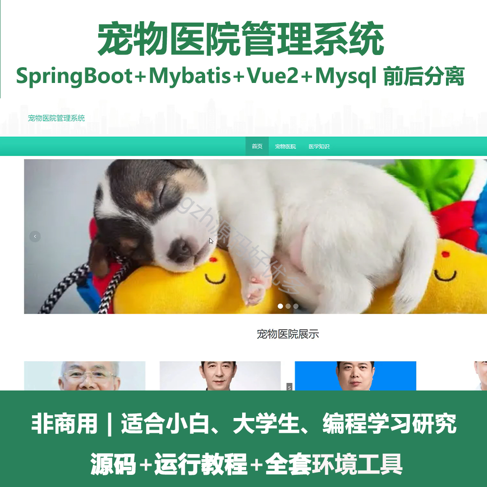
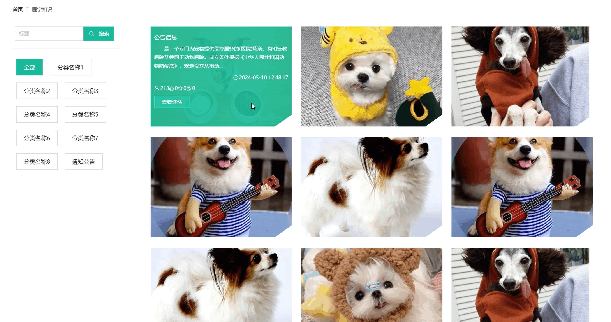
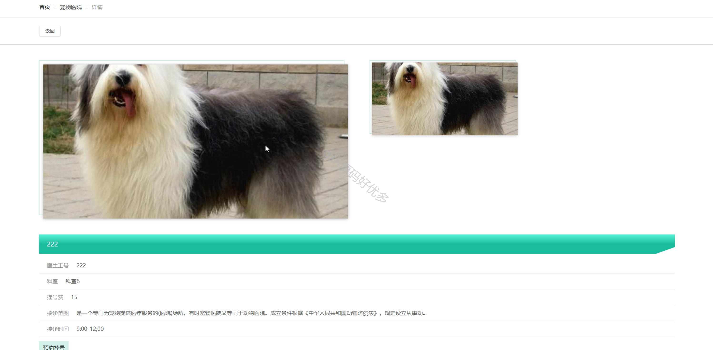
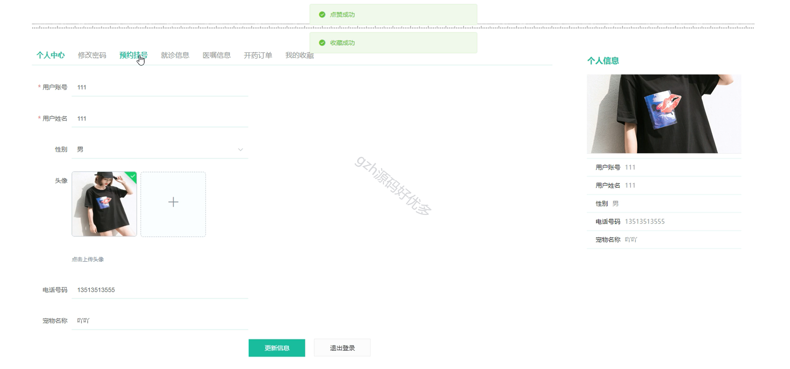
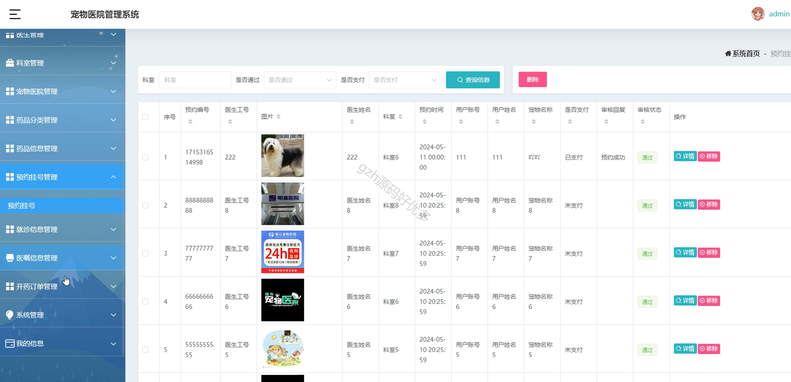
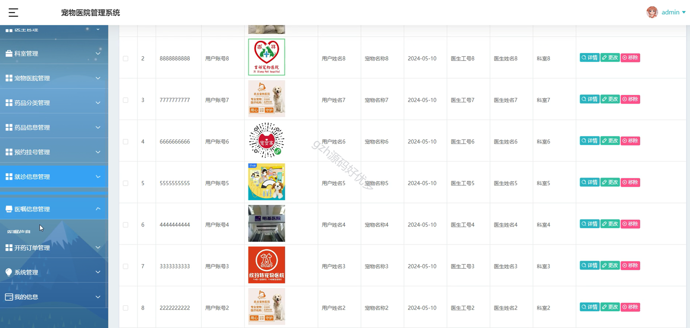
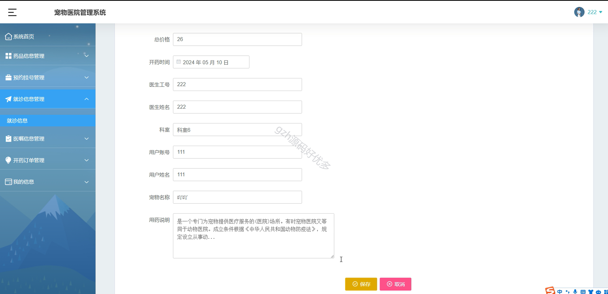

# springbootA355
springbootA355宠物医院管理系统
 
## 查看主页获取源码

### 一、作品包含

源码+数据库+全套环境和工具资源+部署教程

### 二、项目技术

前端技术：Html、Css、Js、Vue2.0、Element-ui、Uniapp

数据库：MySQL

后端技术：Java、Spring Boot、MyBatis

  

### 三、运行环境

开发工具：IDEA/eclipse

数据库：MySQL5.7（最低要5.7版本）

数据库管理工具：Navicat10以上版本

环境配置软件： JDK1.8+Maven3.6.3

前端Nodejs：14

### 四、项目介绍
项目编号：springbootA355

宠物医院系统能优化预约流程，提升诊疗效率，加强医患沟通，全方位助力宠物医院高效运营、提升服务品质 。

该宠物医院管理系统具备用户登录注册、医学知识展示、宠物医院信息呈现、预约挂号、个人信息管理，以及管理员对医生、科室、药品、预约挂号、就诊与医嘱信息、开药订单等进行管理的功能 

### 五、运行截图

  
